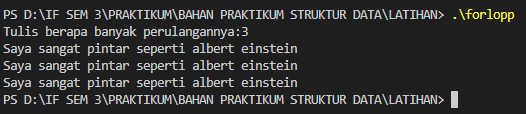
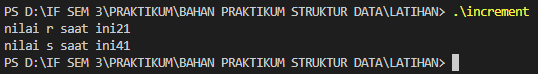
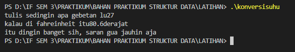
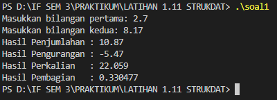
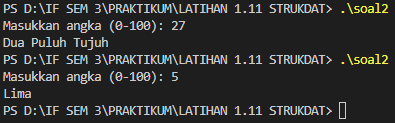
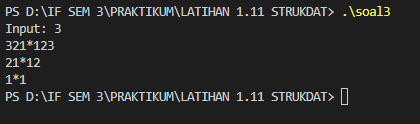

# Template Laporan Praktikum Struktur Data

## 1. Nama, NIM, Kelas
- **Nama**: Zalfa Athallah Pasha Hermawan
- **NIM**: 103112400196
- **Kelas**: S1IF-12-05

## 2. Motivasi Belajar Struktur Data
Struktur data penting dipelajari karena jadi dasar dalam bikin program supaya lebih teratur. Selain buat ngerjain tugas, materi ini juga sering kepakai di aplikasi sehari-hari dan bisa jadi bekal kalau nanti udah masuk dunia kerja.
## 3. Dasar Teori
stuktur data itu ibaratnya buat mengatur dan menyipan supaya bisa di cari, diproses, dan juga di ubah . Nah dari pemilihann stuktur data yang bagus dapat membuat program nya bisa berjalan lebih bagus , lebih efisien dll

- *Array* Array adalah struktur data linear yang menyimpan elemen dengan tipe data yang sama dalam blok memori yang berdekatan. Elemen dalam array diakses menggunakan indeks numerik.
- *Linked List* Linked List adalah struktur data linear di mana setiap elemen (disebut node) berisi data dan pointer yang menunjuk ke node berikutnya. Tidak seperti array, linked list tidak menyimpan elemen secara berurutan di memori.
- *Stack*  
    Stack (tumpukan) adalah struktur data linear yang menerapkan prinsip *Last In, First Out (LIFO)*. Elemen terakhir yang ditambahkan akan menjadi yang pertama diambil.
- *Queue*  
    Queue (antrian) adalah struktur data linear yang menerapkan prinsip *First In, First Out (FIFO)*. Elemen pertama yang masuk akan menjadi yang pertama keluar.
- *Tree*  
    Tidak seperti array, linked list, stack dan queue, yang merupakan struktur data linier, tree adalah struktur data hierarkis. Binary tree adalah jenis struktur tree di mana setiap node memiliki paling banyak dua child, yang disebut sebagai left child dan right child. Binary tree seringkali diimplementasikan menggunakan link.
- *Graph*  
    Graph adalah struktur data yang terdiri dari kumpulan simpul berhingga untuk menyimpan data dan antara dua buah simpul terdapat hubungan saling keterkaitan. Graph merepresentasikan kumpulan object dimana pasangan dari objek terhubung oleh sebuah link.

## 4. Guided
### 4.1 Guided 1
```cpp
#include <iostream>

  

using namespace std;

  

int main() {

    double total_pembelian,diskon;

    cout << "berapa kamu belanja Rp.";

    cin >> total_pembelian;

    if (total_pembelian >= 30000) {

        diskon = 0.1 *total_pembelian;

        cout << "kamu dapat diskon sebesar" << diskon << "orang kaya lu tong";

    }else{

        cout << "kamu belanjanya masih dikit, tambahin lah, biar gua kaya";

    }

    return 0;

}
```

**Penjelasan** : Code di atas menjalankan perintah untuk menghitung diskon saat kita berbelanja dan memunculkan teks pujian jika belanja banyak.

**Output** :


### 4.2 Guided 2
```cpp
#include <iostream>

  

using namespace std;

  

int main() {

    int jumlah;

    cout << "Tulis berapa banyak perulangannya:";

    cin >> jumlah;

    for (int i = 0; i<jumlah; i++){

        cout << "Saya sangat pintar seperti albert einstein" <<endl;

    }

    return 0;

}
```

**Penjelasan** : Code di atas menjalankan perintah untuk perulangan seperti contoh pada output saat saya meminta mengetik saya sangat pintar seperti albert einstein sebanyak tiga kali

**OUTPUT** :

### 4.3 Guided 3
```cpp
#include <iostream>

  

using namespace std;

  

int main() {

    int r = 20;

    int s;

  
  

    s = 20 + ++r;

    cout << "nilai r saat ini" <<r<<endl;

    cout << "nilai s saat ini" <<s<<endl;

    return 0;

}
```

**PENJELASAN** : 
Code di atas berfungsi untuk memunculkan nilai s dan r 
**OUTPUT** : 


### 4.4 Guided 4
```cpp
#include <iostream>

using namespace std;

  

int main() {

    float celcius, fahreinheit;

    cout << "tulis sedingin apa gebetan lu";

    cin>> celcius;

    fahreinheit = (9.0/5.0)* celcius + 32;

    cout << "kalau di fahreinheit itu" << fahreinheit<< "derajat"<<endl;

    cout << "itu dingin banget sih, saran gua jauhin aja";

    return 0;

}
```

***OUTPUT*** :


***PENJELASAN*** : Code di atas menjalankan perintah gua untuk mengkonfersi suhu dari celcius ke fahreinheit dan mengetahui suhu gebetan gua
## 5. Unguided
### 5.1 Unguided 1
```cpp
#include <iostream>

using namespace std;

  

int main() {

    float a, b;

  

    cout << "Masukkan bilangan pertama: ";

    cin >> a;

    cout << "Masukkan bilangan kedua: ";

    cin >> b;

  

    cout << "Hasil Penjumlahan : " << a + b << endl;

    cout << "Hasil Pengurangan : " << a - b << endl;

    cout << "Hasil Perkalian   : " << a * b << endl;

  

    if (b != 0) {

        cout << "Hasil Pembagian   : " << a / b << endl;

    } else {

        cout << "Pembagian tidak bisa dilakukan (pembagi = 0)" << endl;

    }

  

    return 0;

}
```

***OUTPUT*** :


***PENJELASAN*** : Code tersebut berfungsi untuk mengeluarkan output hasil penjumlahan, pengurangan, perkalian dan pembagian
### 5.2 Unguided 2
```cpp
#include <iostream>

using namespace std;

  

int main() {

    int n;

    string satuan[] = {"Nol","Satu","Dua","Tiga","Empat","Lima","Enam","Tujuh","Delapan","Sembilan"};

    string belasan[] = {"Sepuluh","Sebelas","Dua Belas","Tiga Belas","Empat Belas",

                        "Lima Belas","Enam Belas","Tujuh Belas","Delapan Belas","Sembilan Belas"};

    string puluhan[] = {"","","Dua Puluh","Tiga Puluh","Empat Puluh","Lima Puluh",

                        "Enam Puluh","Tujuh Puluh","Delapan Puluh","Sembilan Puluh"};

  

    cout << "Masukkan angka (0-100): ";

    cin >> n;

  

    if (n < 10) cout << satuan[n];

    else if (n < 20) cout << belasan[n-10];

    else if (n < 100) {

        if (n % 10 == 0) cout << puluhan[n/10];

        else cout << puluhan[n/10] << " " << satuan[n%10];

    }

    else if (n == 100) cout << "Seratus";

    else cout << "Diluar jangkauan";

  

    return 0;

}
```

***OUTPUT*** : 


***PENJELASAN*** : Code diatas menjalankan perintah untuk memunculkan angka yang saya minta namun hanya 1-100 karna saya memerintahkan begitu 
### 5.3 Unguided 3
```cpp
#include <iostream>

using namespace std;

  

int main(){

    int n;

    cin >> n;

  

    for(int i=n; i>=1; i--){

        for(int j=i; j>=1; j--){

            cout << j << " ";

        }

  

        cout << "* ";

  

        for(int j=1; j<=i; j++){

            cout << j;

            if(j<i) cout << " ";

        }

        cout << endl;

    }

  

    cout << "*" << endl;

    return 0;

}
```

***OUTPUT*** : 


***PENJELASAN*** : Code ini berfungsi untuk bikin segitiga dari angka dan bintang di tengah. Pertama, program minta user masukin sebuah angka n sebagai tinggi segitiga. Lalu dengan perulangan, program membuat baris demi baris mulai dari angka terbesar sampai 1. Di tiap baris, program tambahin spasi di depan agar posisi bintang selalu lurus ke bawah. lalu , angka dicetak dari besar ke kecil di sisi kiri, lalu bintang, lalu angka naik di sisi kanan. Pola ini berlanjut sampai angka habis
## 6. Kesimpulan
Kesimpulan untuk praktikum Struktur Data yang pertama kali adalah membuat saya menjadi bisa mengoding dengan bahasa pemrogaman C++

## 7. Referensi
1.  [https://dte.telkomuniversity.ac.id/struktur-data-dasar-array-linked-list-stack-dan-queue/](https://dte.telkomuniversity.ac.id/struktur-data-dasar-array-linked-list-stack-dan-queue/)
2.  [https://www.trivusi.web.id/2022/06/mengenal-struktur-data.html](https://www.trivusi.web.id/2022/06/mengenal-struktur-data.html)