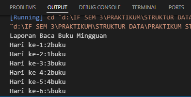
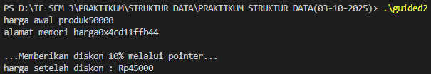
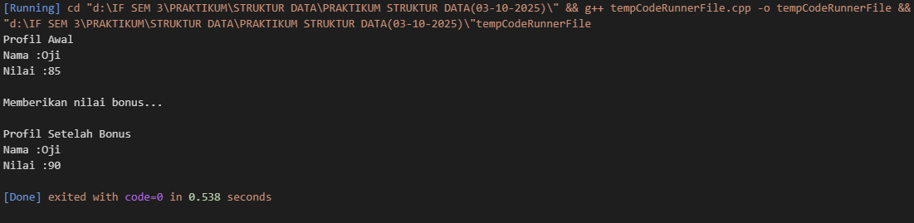
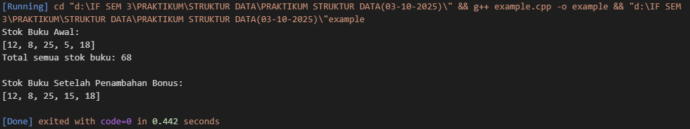

# Template Laporan Praktikum Struktur Data

## 1. Nama, NIM, Kelas
- **Nama**: Zalfa Athallah Pasha Hermawan
- **NIM**: 103112400196
- **Kelas**: S1IF-12-05

## 2. Motivasi Belajar Struktur Data
Struktur data penting dipelajari karena jadi dasar dalam bikin program supaya lebih teratur. Selain buat ngerjain tugas, materi ini juga sering kepakai di aplikasi sehari-hari dan bisa jadi bekal kalau nanti udah masuk dunia kerja.
## 3. Dasar Teori
Struktur data adalah cara untuk menyimpan dan mengorganisir data dalam komputer agar dapat digunakan secara efisien. Berikut adalah teori dasar mengenai Array, Pointer, dan Fungsi:

- **Konsep Array dan Pengolahan Data** Array merupakan struktur data yang berfungsi menyimpan sekumpulan nilai dengan tipe yang sama dalam satu variabel. Dalam C++, elemen array disimpan secara berurutan di memori, sehingga dapat diakses dengan indeks tertentu seperti `arr[i]`. Penggunaan array mempermudah pengolahan data dalam jumlah banyak, misalnya menyimpan stok buku atau nilai siswa. _“Struktur array menjadi dasar penting dalam pengelolaan data karena memungkinkan penyimpanan dan pemrosesan informasi secara efisien serta terorganisir”_ (Kusuma & Rahmadani, 2023).
    
- **Pointer dan Manipulasi Memori** Pointer adalah variabel yang menyimpan alamat memori dari variabel lain. Dengan pointer, program dapat mengakses dan mengubah nilai variabel secara langsung melalui alamatnya, bukan salinannya. Hal ini meningkatkan efisiensi dan fleksibilitas dalam pengolahan data. Contohnya pada program diskon harga dan stok buku, pointer digunakan untuk memodifikasi nilai asli tanpa menyalin data. _“Pemahaman konsep pointer menjadi landasan dalam memahami cara kerja memori komputer serta efisiensi manipulasi data pada bahasa C dan C++”_ (Santoso & Wirawan, 2022).
    
- **Fungsi dan Parameter Referensi** Fungsi dalam C++ digunakan untuk memecah program menjadi bagian-bagian kecil yang dapat digunakan kembali. Salah satu konsep pentingnya adalah _pass by reference_, yaitu ketika variabel dikirim ke fungsi bukan sebagai salinan, tetapi sebagai referensi ke variabel asli. Dengan begitu, perubahan di dalam fungsi langsung mempengaruhi data aslinya. _“Penggunaan parameter referensi dalam fungsi memungkinkan efisiensi pemrosesan data dan mendukung prinsip modularitas dalam pemrograman”_ (Putri & Nugroho, 2021).
## 4. Guided
### 4.1 Guided 1
```cpp
//Array

#include <iostream>

  

using namespace std;

  

int main(){

    int bukuPerHari[7] = {2,1,3,2,4,5,1};

    int totalBuku = 0;

  

    cout << "Laporan Baca Buku Mingguan" << endl;

  

    for (int i = 0; i < 7; i++){

  

        cout << "Hari ke-" << i+ 1 << ":" << bukuPerHari [i]

        << "buku" << endl;

    }

}
```

**Penjelasan** : Code di atas menjalankan perintah untuk menampilkan laporan baca buku mingguan

**Output** :


### 4.2 Guided 2
```cpp
//Pointer

  

#include <iostream>

using namespace std;

  

int main(){

    float hargaProduk = 50000.0f;

    //deklarasi pointer

    float* ptrHarga =& hargaProduk;

  

    cout << "harga awal produk" << hargaProduk << endl;

    cout << "alamat memori harga" << ptrHarga << endl;

  

    cout <<"\n...Memberikan diskon 10% melalui pointer..."<< endl;

    *ptrHarga= *ptrHarga*0.9;

    cout << "harga setelah diskon : Rp" << hargaProduk << endl;

    return 0;

}
```

**Penjelasan** : Code di atas menjalankan perintah untuk menampilkan harga awal produk dan harga setelah diskon sebesar 10% menggunakan pointer

**OUTPUT** :

### 4.3 Guided 3
```cpp
#include <iostream>

#include <string>

using namespace std;

  

float hitungRataRata(int nilaiTugas, int nilaiUTS){

    return (nilaiTugas + nilaiUTS) / 2.0f;

}

  

void cetakProfil(string nama, float nilai){

    cout << "Nama :" << nama << endl;

    cout << "Nilai :" << nilai << endl;

}

  

void beriNilaiBonus(float &nilai) {

    nilai += 5.0f;

}

  

int main(){

    string namaSiswa = "Oji";

    int tugas = 80, uts = 90;

  

    float nilaiAkhir = hitungRataRata(tugas, uts);

  

    cout << "Profil Awal" << endl;

    cetakProfil(namaSiswa, nilaiAkhir);

  

    cout<<"\nMemberikan nilai bonus..." << endl;

    beriNilaiBonus(nilaiAkhir);

  

    cout << "\nProfil Setelah Bonus" << endl;

    cetakProfil(namaSiswa, nilaiAkhir);

  

    return 0;

}
```

**PENJELASAN** : 
Code di atas berfungsi untuk memunculkan profil awal mahasiswa dengan nilai sebelum di berikan nilai bonus dan setelah di berikan nilai bonus
**OUTPUT** : 


### 4.4 Guided 4
```cpp
```

***OUTPUT*** :


***PENJELASAN*** : Code di atas menjalankan perintah gua untuk mengkonfersi suhu dari celcius ke fahreinheit dan mengetahui suhu gebetan gua
## 5. Unguided
### 5.1 Unguided 1
```cpp
#include <iostream>

using namespace std;

  

void cetakStok(int arr[], int size) {

    cout << "[";

    for (int i = 0; i < size; i++) {

        cout << arr[i] << (i == size - 1 ? "" : ", ");

    }

    cout << "]" << endl;

}

  

int hitungTotalStok(int arr[], int size) {

    int total = 0;

    for (int i = 0; i < size; i++) {

        total += arr[i];

    }

    return total;

}

  

int* cariStokPalingSedikit(int arr[], int size) {

    int* ptrPalingSedikit = &arr[0];

  

    for (int i = 1; i < size; i++) {

        if (arr[i] < *ptrPalingSedikit) {

            ptrPalingSedikit = &arr[i];

        }

    }

  

    return ptrPalingSedikit;

}

  

void tambahStokBonus(int* ptrStok) {

    *ptrStok += 10; // Menambahkan 10 ke nilai yang ditunjuk oleh pointer.

}

  

int main() {

    int stokBuku[] = {12, 8, 25, 5, 18};

    int jumlahJenisBuku = 5;

  

    cout << "Stok Buku Awal:" << endl;

    cetakStok(stokBuku, jumlahJenisBuku);

  

    int total = hitungTotalStok(stokBuku, jumlahJenisBuku);

    cout << "Total semua stok buku: " << total << endl;

  

    int* ptrStokRendah = cariStokPalingSedikit(stokBuku, jumlahJenisBuku);

  

    tambahStokBonus(ptrStokRendah);

  

    cout << "\nStok Buku Setelah Penambahan Bonus:" << endl;

    cetakStok(stokBuku, jumlahJenisBuku);

  

    return 0;

}
```

***OUTPUT*** :


***PENJELASAN*** : Code tersebut berfungsi untuk memperlihatkan stok buku awal, total semua stok buku, dan stok buku setelah di tambahkan bonus
### 5.2 Unguided 2
```cpp


```

***OUTPUT*** : 


***PENJELASAN*** : Code diatas menjalankan perintah untuk 
### 5.3 Unguided 3
```cpp

```

***OUTPUT*** : 


***PENJELASAN*** : Code ini berfungsi untuk 
## 6. Kesimpulan
Kesimpulan untuk praktikum Struktur Data yang pertama kali adalah membuat saya menjadi bisa mengoding dengan bahasa pemrogaman C++

## 7. Referensi
1.  [https://dte.telkomuniversity.ac.id/struktur-data-dasar-array-linked-list-stack-dan-queue/](https://dte.telkomuniversity.ac.id/struktur-data-dasar-array-linked-list-stack-dan-queue/)
2.  [https://www.trivusi.web.id/2022/06/mengenal-struktur-data.html](https://www.trivusi.web.id/2022/06/mengenal-struktur-data.html)